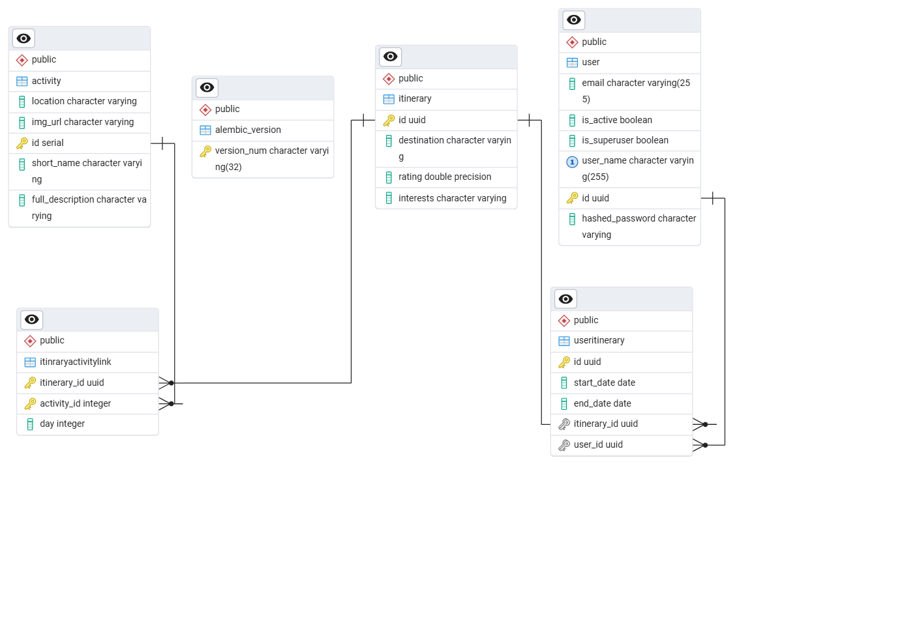

# Travel Advisor

A full-stack travel itinerary planner web application. TravelAdvisor allows users to create and manage trip itineraries and activities. The project includes a Python FastAPI backend and a React (Vite) frontend.

## Getting Started

Install Docker and Docker compose

## How to run

Download the docker compose image travel_advisor.tar

In the folder containing the downloaded image travel_advisor.tar Run 
```bash
docker load -i travel_advisor.tar
```

Clone/download the repo https://github.com/3mad10/TravelAdvisor

Modify the .env file in the repo

In the cloned repo run Run 
```bash
docker-compose up --build
``` 
After the services start The frontend should be running on http://localhost:3000/ 

## API Routes
| Route      | Method |  Description     |
| ----------- | ----------- | ----------- |
| /api/itinerary/generate|  post      | Generate a travel plan based on input interests |
| /api/itinerary/   | post        | Add a travel plan to the user saved plans  |
| /api/itinerary/{id}   | delete        | Delete a travel plan  |
| /api/itinerary/   | get        | Get user saved travel plans  |
| /api/itinerary/{id}   | get        | Get a specific travel plan  |
| /api/itinerary/{id}   | patch        | update a specific travel plan  |

## Data schema


## Gemini Studio Integration
Gemini is currently used to generate the travel plans using a prompt that takes the input from the user and call the gemini api to generate a plan with a response_model=ActivityLLMOutput

## Known Issue and limitations
1. \[Issue] After saving a plan the Saved plans container does not get updated automatically, it needs a refresh to add the newly saved plan to the container

2. \[Issue] Issue when adding more than one interest there is no response in the frontend (probably a frontend isssue as backend handle more than one interest correctly)

3. \[Performance Improvement] Due to the current Data model PrivateItinerary links to Publicitineraries there can be many requests to the server which might lead to crashing as there is no limit to the number of requests that can be taken

4. \[limitation] Currently updating the itinerary is not supported in the frontend side

5. \[limitation] The User can not view a full saved plan from before

6. \[limitation] The User can update a plan by only modifyiing the activies or interests but cant delete an activity

7. \[limitation] Gemini is not used to update activities or add certain constraints such as Budget to the generated activities